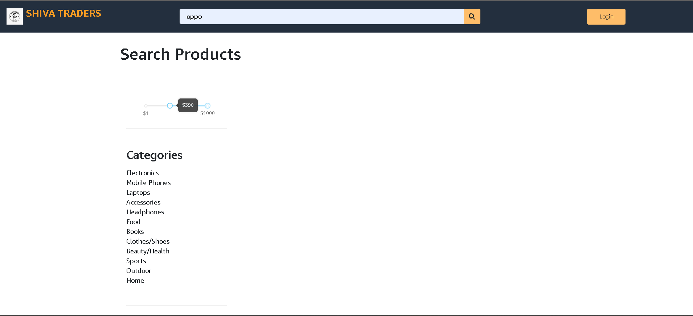
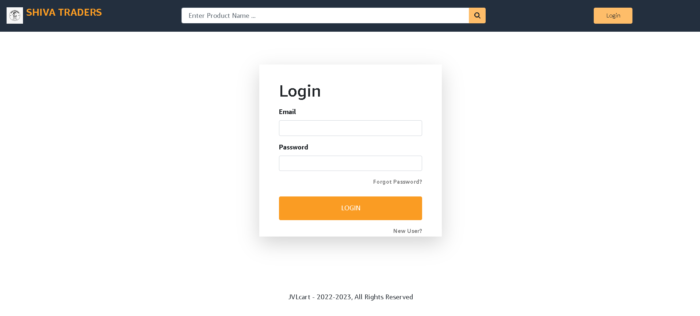

# 🛒 SivaTraders

**SivaTraders** is a modern and responsive **e-commerce website** built using the **MERN Stack** (MongoDB, Express.js, React.js, Node.js). It functions as a full-featured online shopping platform where users can browse, search, favorite, and purchase products, similar to real-world e-commerce giants.

---

## 📌 Description

SivaTraders enables users to:

- 🔍 Search products with category and price filters
- 🛍️ Buy products securely
- ❤️ Save products to a "Favorites" wishlist
- ⭐ Rate and review products
- 👤 Manage their buyer account (login, profile, etc.)

This project offers a clean UI, smooth navigation, and practical features required for scalable e-commerce platforms.

---

## ✨ Features

- 🔐 User registration and login
- 📦 Product listing with filters and search
- 🔄 Real-time price range slider
- ❤️ Wishlist/favorites functionality
- ⭐ Product rating system
- 🛍️ Shopping cart & checkout
- 👤 Buyer account dashboard
- 📱 Mobile-responsive UI

---

## 🛠️ Tech Stack

- **Frontend**: React.js, Tailwind CSS / CSS3
- **Backend**: Node.js, Express.js
- **Database**: MongoDB
- **Authentication**: JWT (if used)
- **Tools**: VS Code, Postman, GitHub

---

## 🖼️ Screenshots

| Home / Search Page | Login Page |
|--------------------|------------|
|  |  |

---

## 🚀 How to Run Locally

> ⚠️ Ensure your VS Code is properly set up for MERN stack development (Node.js, npm, MongoDB).

### 1. Clone the repository
```bash
git clone https://github.com/ZamranAhamed/SivaTraders.git
cd SivaTraders
